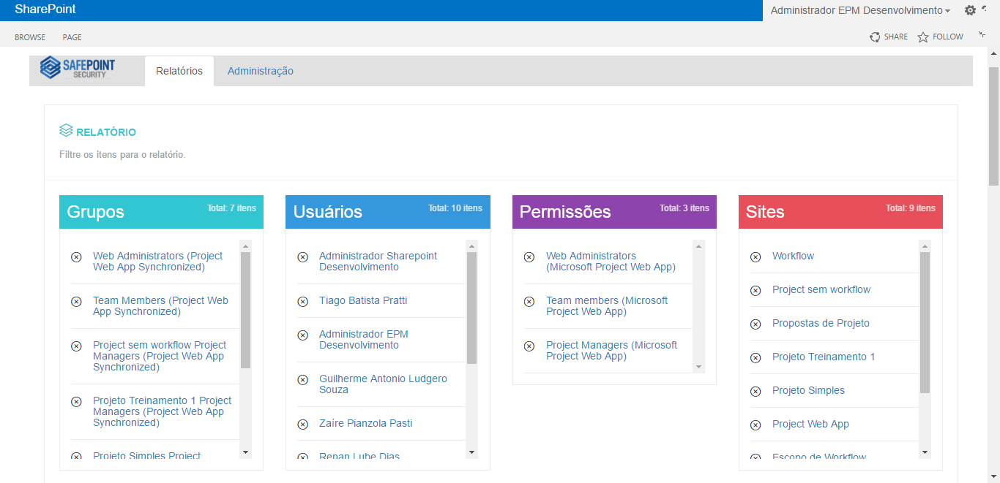
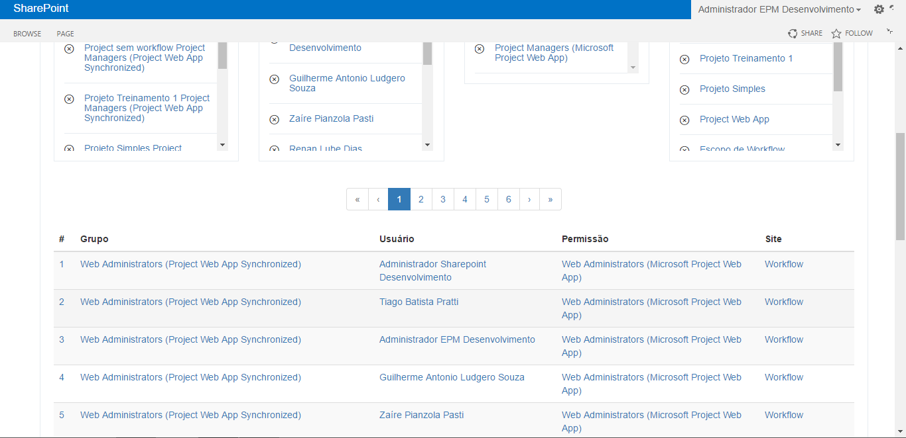
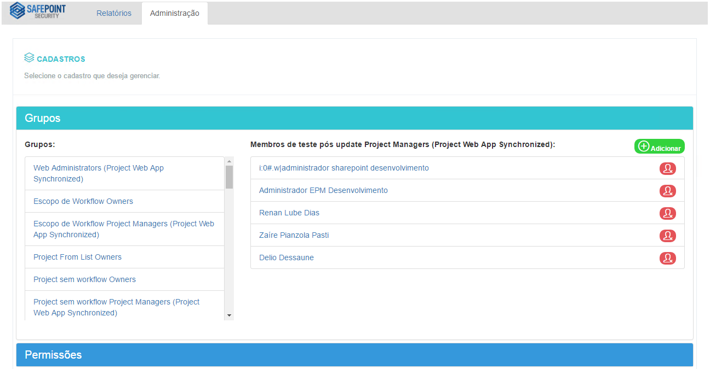
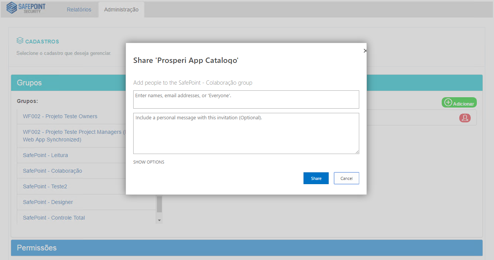
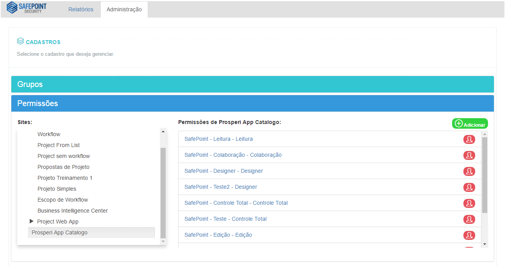
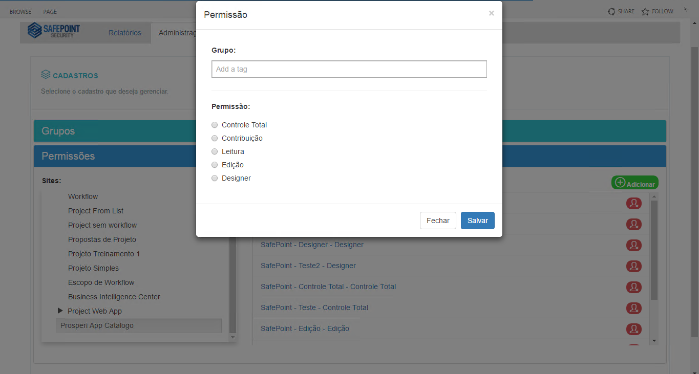

# SafePoint Security

Projeto de software construído em atendimento à disciplina de TCC-2 da <a href="https://www.ucl.br/">Faculdade do Centro Leste</a> - Período 2016/02.

O mesmo trata-se do desenvolvimento de uma ferramenta capaz de auxiliar os profissionais administradores de ambientes SharePoint, a controlar da melhor forma as atividades no gerenciamento de segurança. Com a adoção dessa solução espera-se uma redução significativa dos incidentes relacionados ao controle de segurança e uma expectativa de economia em relação aos custos com consultorias.


## Sumário

* [Instalação](#instalacao)
* [Protótipos](#prototipos)
* [Autores](#autores)
* [Orientador](#orientador)


## <a name="instalacao"></a> Instalação

Comandos SharePoint Management Shell:

```powershell
Add-SPSolution -LiteralPath <PATH WSP FILE>
```
```powershell
Install-SPSolution -Identity SafePointSecurity.wsp -WebApplication <WEBAPPLICATION NAME> -GACDeployment
```
```powershell
Enable-SPFeature -identity  31d859bc-a61d-4bfc-ba39-08c9982b8a72 -Force
```
```powershell
Enable-SPFeature -identity d98ad088-a33b-4f2a-9548-cafac22c55a7 -Url <URL SITECOLLECTION> -Force
```

Interface Web:
* Adicione uma nova página na Biblioteca de Páginas(SitePages) de um Conjuntos de Sites(Site Collection);
* Edite a página recém-criada e clique em Inserir Web Part;
* Na categoria SafePoint, selecione a webpart SafePointSecurity;
* Nas proriedades da Web Part, navegue até a seção SafePoint - Configurações e preencha as proriedades solicitadas;


## <a name="prototipos"></a> Protótipos














## <a name="autores"></a> Autores

* **Wilhas Mendes de Souza** - *Desenvolvedor/Analista de Requisitos* - <wilhsms@gmail.com>
* **Zaíre Pianzola Pasti** - *Desenvolvedor/Analista de Requisitos* - <zazapasti@gmail.com>


## <a name="orientador"></a> Orientador

* **André Ribeiro** - *Professor e Coordenador do curso de Sistemas de Informação* - <andrers@ucl.br>
